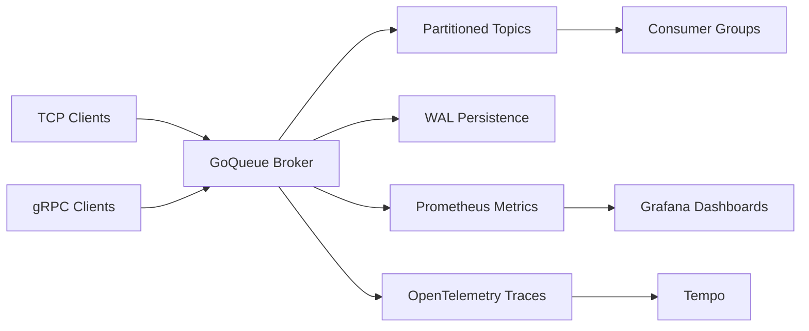

<p align="center">
  

</p>

<h1 align="center">GoQueue</h1>

<p align="center">
  A partitioned Go message broker with TCP and gRPC transport, WAL-backed replay, and production-style observability for local workloads.
</p>

<p align="center">
  
  
  
  
  
  
</p>

## Overview
`GoQueue` is built for lightweight event and queue workloads where you want a compact broker with a clean developer experience. It supports TCP workflows, typed gRPC APIs, deterministic partition routing, write-ahead logging for replay, and a ready-to-run observability stack.

## Current Scope
- Single-node broker process with partitioned in-memory topics and WAL replay.
- Docker Compose starts multiple independent broker nodes for local topology demos and observability.
- Raft fields and dashboards are metadata labels only in the current version (no consensus replication yet).

## Tech Stack
<p>
  
  
  
  
  
  
  
  
  
  
</p>

## Core Capabilities
| Capability | What it gives you |
| --- | --- |
| TCP + gRPC interfaces | Use the lightweight TCP protocol for simple clients or gRPC for typed contracts and streaming. |
| Partitioned topics | Route by round-robin, explicit partition, or stable key-based partitioning. |
| WAL replay | Recover broker state from persisted records on startup (including partition metadata in WAL v2 records). |
| Consumer groups | Consume by group and partition for predictable scaling behavior. |
| Metrics + tracing | Export Prometheus metrics and OpenTelemetry traces for visibility. |
| Local observability stack | Bring up Grafana, Prometheus, and Tempo with Docker Compose. |

## Architecture


## Quick Start
### 1. Run the broker
```bash
go run ./cmd/broker --tcp-addr=:9090 --grpc-addr=:9095 --metrics-addr=:2112 --wal-path=data/goqueue.wal
```

### 2. Publish and consume over TCP
```bash
go run ./cmd/goqueue publish --addr localhost:9090 --topic orders "hello tcp"
go run ./cmd/goqueue consume --addr localhost:9090 --topic orders --group payment-service
```

### 3. Publish and consume over gRPC
```bash
go run ./cmd/goqueue publish --grpc --addr localhost:9095 --topic orders "hello grpc"
go run ./cmd/goqueue consume --grpc --addr localhost:9095 --topic orders --group payment-service --partition -1
```

## Partition Routing
### Keyed routing
Use a stable key when related messages must land on the same partition.

```bash
go run ./cmd/goqueue publish --grpc --addr localhost:9095 --topic orders --key user-42 "order-a"
go run ./cmd/goqueue publish --grpc --addr localhost:9095 --topic orders --key user-42 "order-b"
```

### Explicit partition targeting
Route directly to a chosen partition for debugging or controlled workloads.

```bash
go run ./cmd/goqueue publish --grpc --addr localhost:9095 --topic orders --partition 2 "force-p2"
go run ./cmd/goqueue consume --grpc --addr localhost:9095 --topic orders --group debug --partition 2
```

## Observability
Bring up the local observability stack:

```bash
docker compose up --build
```

Available services:

- Grafana: `http://localhost:3000`
- Prometheus: `http://localhost:9099`
- Tempo API: `http://localhost:3200`
- Broker metrics endpoint: `http://localhost:2112/metrics`
- Broker readiness endpoint: `http://localhost:2112/readyz`
- Broker raft state endpoint: `http://localhost:2112/raft/state`

The Grafana dashboard is auto-loaded as **GoQueue Observability**.

To generate traces for the trace panel, publish and consume over gRPC while the stack is running:

```bash
go run ./cmd/goqueue publish --grpc --addr localhost:9191 --topic orders "trace-me"
go run ./cmd/goqueue consume --grpc --addr localhost:9191 --topic orders --group trace-demo --partition -1
```

## Benchmark Results (Local Reference)
The benchmark suite includes both in-process and localhost TCP workloads in [bench/bench_test.go](bench/bench_test.go).

Run benchmark reports:

```bash
GOQUEUE_BENCH=1 go test ./bench -run TestThroughputReport -count=1 -v
GOQUEUE_BENCH=1 go test ./bench -run TestTCPThroughputReport -count=1 -v
```

Example local output from this repo on a developer machine:
- In-process publish (256B payload): `~4.3M msgs/sec`
- TCP end-to-end publish on localhost (256B payload): `~45K msgs/sec`

Treat these as machine-specific local benchmarks, not production SLAs.

## Protobuf Code Generation
```bash
go run github.com/bufbuild/buf/cmd/buf@latest generate
```

## Project Layout
```text
cmd/broker       broker server entrypoint
cmd/goqueue      CLI client for publish and consume
internal/broker  topic, subscription, and routing logic
internal/metrics Prometheus metrics integration
internal/telemetry OpenTelemetry tracing setup
internal/wal     write-ahead log and replay
proto            gRPC and protobuf contracts
```

## Why GoQueue
- Clean local developer workflow with `go run` and `docker compose`
- Modern transport mix with low-level TCP and typed gRPC
- Useful observability defaults for demos, debugging, and performance profiling
- Small enough to understand quickly, capable enough to extend into a richer broker
